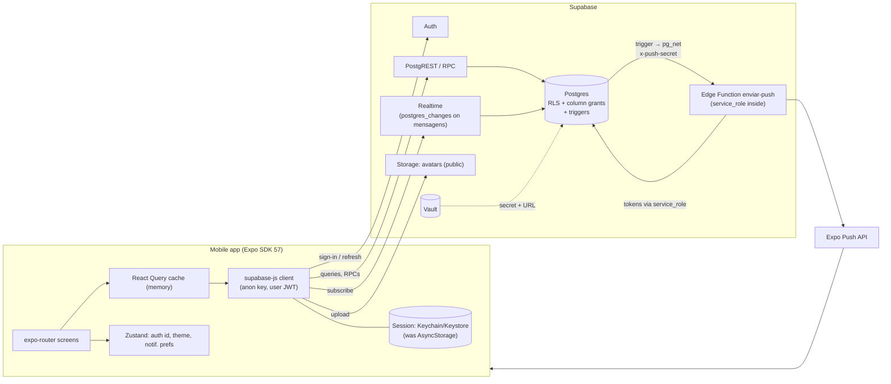

# Estou Dentro — Architecture & Security Audit

| | |
| --- | --- |
| Audited revision | `ec9a473` on branch `upgrade/sdk-57` (Expo SDK 57, migrations `0001`–`0017`, Edge Function `enviar-push`) |
| Date | 2026-09-28 |
| Baseline | OWASP MASVS v2; Supabase guidance for RLS, Vault, pg_net and Edge Function auth; Expo SDK 57 docs |
| Outcome | 2 CRITICAL and 4 HIGH findings, **all fixed** in this change set (migration `0018`, Edge Function, client). 13 MEDIUM, 13 LOW and 10 IMPROVEMENT items are documented here and, apart from L8 (same code as C1), **not** implemented, per the scope of this task. |

## Executive summary

The project already had a solid base: RLS is enabled on every table, sensitive profile
columns are hidden with column-level grants, the job state machine lives in a trigger,
and no `service_role` key ships in the app. The audit still found two ways to defeat
the core trust model of the marketplace, plus four serious issues:

- **C1 — anyone could push notifications to any user.** The `enviar-push` Edge Function
  had no caller check beyond the gateway's `verify_jwt`, which accepts any valid JWT —
  including the public anon key inside the app. Attacker-chosen title, text and tap
  target, sent to any user ID, with the app's own identity.
- **C2 — the job lifecycle could be forged at INSERT.** The state-machine trigger only
  ran on UPDATE. Inserting a job that was *already* `concluido` with an arbitrary
  "selected worker" let any account leave 1-star reviews on **any user**, open a chat
  with anyone, and pin its job to the top of everyone's feed. Reproduced end to end.
- **H1 — exact GPS of every open job was recoverable** through `bicos_proximos`
  (trilateration gave the true coordinates with **0.00 m** error from 3 calls),
  contradicting what the app tells users before asking for location.
- **H2 — the README told operators to store the `service_role` key in a database
  setting** readable by every database session, including role `authenticated`.
- **H3 — following that same README broke the app:** the push trigger calls a
  function that does not exist, so every new message and every job application failed.
- **H4 — the auth session (including the long-lived refresh token) was stored in
  AsyncStorage**, which is unencrypted and included in device backups.

Deploying the fixes requires: running migration `0018`, creating two Vault secrets and
one Edge Function secret, redeploying `enviar-push`, and shipping **new native builds**
(a native module was added). See [§19](#19-manual-supabase-configuration-and-deployment).

> **Phase 2 update.** Migration `0019` (see [`JOB_LIFECYCLE_DESIGN.md`](JOB_LIFECYCLE_DESIGN.md))
> replaced the job workflow with RPC-only transitions and fixed **M5** and **M10**;
> lifecycle actions also require an active account (part of **M6**). The new sensitive
> data (cancellation reasons, disputes) is readable only by the two participants, so it
> does not widen **M2**. The §9 matrices below describe the Phase 1 state; the current
> rules for `bicos`, `candidaturas` and `avaliacoes` are in the design document.

| Severity | Found | Fixed here | Open |
| --- | ---: | ---: | ---: |
| CRITICAL | 2 | 2 | 0 |
| HIGH | 4 | 4 | 0 |
| MEDIUM | 13 | 0 | 13 |
| LOW | 13 | 1 (L8, same code as C1) | 12 |
| IMPROVEMENT | 10 | 0 | 10 |

## 1. How this audit was done

1. **Read everything:** `AGENTS.md`, `CLAUDE.md`, `README.md`, all of `src/`, all 17
   migrations, the Edge Function, `app.json`, `eas.json`, `tsconfig.json`, and the
   installed `@supabase/auth-js` source (to confirm how the session is persisted).
2. **Executed the schema, not just read it.** All 17 migrations (and later `0018`) were
   applied, unchanged, to PostgreSQL 18.3 + PostGIS 3.6 (PGlite) together with an
   emulation of the Supabase pieces they depend on: roles `anon` / `authenticated` /
   `service_role` with Supabase's default grants, `auth.uid()` reading
   `request.jwt.claims` exactly like Supabase, and the `storage`, Vault and `pg_net`
   interfaces. Every CRITICAL/HIGH finding was reproduced as an attack **before**
   writing the fix, and the same attack was re-run afterwards.
3. **Docs checked for SDK 57 / current Supabase:** `expo-secure-store` (SDK 57),
   the Expo "Using Supabase" guide, Supabase Edge Function auth, Vault + `pg_net`
   scheduling guide, Storage access control, Realtime Postgres Changes limits.

**Limits.** This was not the real Supabase stack: Auth, Storage, Realtime and the Edge
runtime behaviour come from their documentation. The Edge Function was not executed
under Deno; its auth/validation logic is unit-tested under Node and the handler was
type-checked against the real `supabase-js` types. The mobile app was bundled for
Android but not run on a device. Nothing was changed in any Supabase project.

## 2. Architecture overview



**Trust boundaries.** The device is untrusted: anything in `src/` is advisory. All
authorization must hold in Postgres (RLS, column grants, triggers, RPCs) or in the Edge
Function. The only privileged credentials are the `service_role` key (auto-injected
into the Edge Function runtime) and, after this change, the single-purpose
`PUSH_WEBHOOK_SECRET` (Edge Function secret + Vault). There is no admin role in the
app; "admin" below means the Supabase dashboard / `service_role`, which bypass RLS.

**Where the rules live.**

| Rule | Mechanism |
| --- | --- |
| Row visibility / ownership | RLS policies on every table (all `to authenticated`) |
| Sensitive columns (`telefone`, CPF/CNPJ, birth date, address, email, GPS) | Table `SELECT` revoked from `authenticated`, re-granted per column; owner reads via `meu_telefone()` / `meus_dados_pessoais()` |
| Which columns users may write | Column-level `UPDATE` grants (`profiles`, `mensagens`, `conversas`, `candidaturas`, `chaves_pix`, `push_tokens`) |
| Job state machine, selected worker | Triggers `validar_insercao_bico` (new) and `validar_transicao_bico` |
| Multi-step business operations | RPCs `escolher_candidato`, `fechar_bico_e_avaliar` (SECURITY INVOKER, so RLS still applies) |
| Reputation | Trigger `avaliacoes_recalcular_reputacao` → `recalcular_reputacao` (not callable by users) |
| Push | AFTER INSERT triggers → `notificar_push` → `pg_net` → Edge Function |

## 3. Findings summary

| ID | Severity | Title | Status | DB migration |
| --- | --- | --- | --- | --- |
| C1 | CRITICAL | Push Edge Function callable by anyone with a valid JWT (incl. the public anon key) | **Fixed** | Yes (`0018`) + redeploy |
| C2 | CRITICAL | Job lifecycle forgeable at INSERT → review bombing and DMs to any user, feed pinning | **Fixed** | Yes (`0018`) |
| H1 | HIGH | `bicos_proximos` reveals the exact GPS of every open job | **Fixed** | Yes (`0018`) |
| H2 | HIGH | `service_role` key stored in a database setting readable by every session | **Fixed** (+ manual rotation) | Yes (`0018`) |
| H3 | HIGH | Push trigger calls a non-existent function → messages and applications fail once configured | **Fixed** | Yes (`0018`) |
| H4 | HIGH | Session and refresh token stored unencrypted in AsyncStorage (included in backups) | **Fixed** (new native build) | No |
| M1 | MEDIUM | Avatars bucket listable by anonymous callers (user-ID enumeration) | Open | Yes |
| M2 | MEDIUM | Every job — including closed ones, worker and price — readable by every user | Open | Yes |
| M3 | MEDIUM | CPF/CNPJ unique index = existence oracle + identity squatting | Open | Yes |
| M4 | MEDIUM | A chat participant can hide/unhide the conversation for the other party | Open | Yes |
| M5 | MEDIUM | Application integrity (self-application, status chosen on insert, owner flips statuses any time) | **Fixed in Phase 2** (`0019`) | Yes |
| M6 | MEDIUM | Account suspension (`status_conta`) only partially enforced | Partly: all Phase 2 lifecycle RPCs require an active account | Yes |
| M7 | MEDIUM | No rate limiting on writes (each message also triggers a push) | Open | Yes |
| M8 | MEDIUM | Push token not reassigned / not cleaned on remote logout → previous account's notifications reach the device | Open | Yes |
| M9 | MEDIUM | Notification body shows sender and message preview on the lock screen | Open | Yes (text built in trigger) |
| M10 | MEDIUM | Contractor controls completion/cancellation unilaterally | **Fixed in Phase 2** (`0019`: worker finishes, owner confirms; owner cannot cancel after start) | Yes |
| M11 | MEDIUM | Auth hardening depends on dashboard settings (password policy, email confirmation, CAPTCHA) | Open (manual) | No |
| M12 | MEDIUM | LGPD: no account deletion or data export | Open | Yes |
| M13 | MEDIUM | Avatar images not re-encoded; EXIF (possibly GPS) may reach a public bucket | Open (verify on device) | No |
| L1–L13 | LOW | See [§7](#7-low) | L8 fixed, rest open | Mixed |
| I1–I10 | IMPROVEMENT | See [§8](#8-improvements) | Open | Mixed |

---

## 4. CRITICAL

### C1 — Push Edge Function callable by anyone holding a valid JWT

- **Affected:** [`supabase/functions/enviar-push/index.ts`](../supabase/functions/enviar-push/index.ts)
  (the whole handler, pre-fix), deployment default `verify_jwt = true`,
  [`0017_push_tokens.sql:61-89`](../supabase/migrations/0017_push_tokens.sql#L61-L89).
- **Problem.** The handler performed no authentication of its own. The comment
  *"Esta função só é alcançável pelos triggers"* was not enforced anywhere: the
  gateway's `verify_jwt` only checks that the `Authorization` header carries a JWT
  signed for the project — every signed-in user's access token qualifies, and so does
  the legacy anon key shipped in the app bundle. `usuario_id`, `titulo`, `corpo` and
  `dados` were used verbatim, and the recipient's device tokens were read with the
  `service_role` key.
- **Attack.** Sign up (sign-up is open), list user IDs (`select id from profiles` is
  allowed for any authenticated user), then loop
  `POST /functions/v1/enviar-push` with
  `{"usuario_id":"<id>","titulo":"Estou Dentro","corpo":"Sua conta será bloqueada, confirme seus dados…","dados":{…}}`.
  Every user with push enabled receives a notification indistinguishable from a real
  one; `dados` decides which screen opens on tap. The same loop exhausts the project's
  Expo push throughput, delaying legitimate notifications, and the `enviados` count in
  the response revealed how many devices each user has.
- **Evidence.** Code review (no Deno runtime here). The fix is covered by unit tests
  ([`validacao.test.ts`](../supabase/functions/enviar-push/validacao.test.ts)) and by
  `push.test.sql` for the database side.
- **Fix (implemented).**
  - The handler now requires header `x-push-secret` equal to the Edge secret
    `PUSH_WEBHOOK_SECRET` (constant-time comparison of SHA-256 digests; if the secret is
    not configured the function refuses everything — fail closed). Authentication
    happens before the body is read; bodies over 16 KB are rejected.
  - Strict input validation ([`validacao.ts`](../supabase/functions/enviar-push/validacao.ts)):
    recipient must be a UUID; title ≤ 120 and body ≤ 300 characters (cut on code
    points); `dados` is reduced to the only two shapes the app navigates to
    (`{tipo:'mensagem', conversa_id:uuid}` / `{tipo:'candidatura', bico_id:uuid}`).
  - [`supabase/config.toml`](../supabase/config.toml) sets `verify_jwt = false` for this
    function: it authenticates itself, and the database has no JWT to send.
  - Database side (`0018`): `notificar_push` sends the dedicated secret from Vault —
    never the `service_role` key (see H2).
  - Logs no longer include Expo's error bodies, which can quote device tokens (L8).
- **Migration required:** yes (`0018`), plus redeploy and secrets ([§19](#19-manual-supabase-configuration-and-deployment)).

### C2 — Job lifecycle forgeable at INSERT (review bombing, DMs to anyone, feed pinning)

- **Affected:** [`0001_init.sql:98`](../supabase/migrations/0001_init.sql#L98) and
  [`0015_corrige_rls_bicos.sql:199-202`](../supabase/migrations/0015_corrige_rls_bicos.sql#L199-L202)
  (INSERT policy only checks `criado_por`);
  [`0015:31-65`](../supabase/migrations/0015_corrige_rls_bicos.sql#L31-L65)
  (`validar_transicao_bico` is `BEFORE UPDATE` only);
  [`0015:232-248`](../supabase/migrations/0015_corrige_rls_bicos.sql#L232-L248)
  (review policy trusts `bicos.status` / `candidato_selecionado_id`);
  [`0010:67-81`](../supabase/migrations/0010_corrige_rls_critica.sql#L67-L81)
  (conversation policy trusts the same pair).
- **Problem.** `bicos` accepted `status`, `candidato_selecionado_id` and `criado_em`
  from the client on INSERT. Every downstream rule (who may review whom, who may open a
  chat with whom) trusts those columns. `0015` closed this hole for UPDATE only.
  On UPDATE, the owner could also select an applicant who had **withdrawn** or been
  **rejected**, select **themselves** (after applying to their own job), and rewrite
  `criado_em`.
- **Attack (reproduced on `0001`–`0017`):**
  1. `insert into bicos (criado_por, titulo, status, candidato_selecionado_id) values (<me>, 'x', 'concluido', <victim>)` — accepted.
  2. `insert into avaliacoes (…, avaliado_id = <victim>, papel_avaliado = 'prestador', nota = 1, comentario = 'Golpista')` — accepted; the victim's public `nota_media_como_prestador` became **1.00**. Repeatable without limit.
  3. Same with `status = 'em_andamento'` → `insert into conversas (<me>, <victim>)` → `insert into mensagens` — accepted: unsolicited DM (and push) to any user.
  4. `criado_em = now() + interval '10 years'` → the job stays first in every user's feed (feed is ordered by `criado_em`).
- **Fix (implemented, `0018`).**
  - New trigger `validar_insercao_bico` (BEFORE INSERT): a new job must be `aberto` with
    no selected worker (otherwise `P0001`); `criado_em`/`atualizado_em` are always set by
    the server.
  - `validar_transicao_bico` now also: makes `criado_por`/`criado_em` immutable; refuses
    the owner as worker; requires the chosen worker to have a candidatura with status
    `pendente` or `aceita` (`escolher_candidato` sets `aceita` before updating the job,
    so the RPC keeps working).
  - Both triggers apply to every role, including `service_role`: if you ever need to
    import historical jobs, disable the trigger for that session explicitly.
  - No UI flow changes: the app never sends those columns.
- **Existing data:** forged rows created before the fix are **not** removed
  automatically — run the checks in [§20](#20-post-deploy-data-checks).
- **Migration required:** yes (`0018`).

---

## 5. HIGH

### H1 — `bicos_proximos` reveals the exact GPS of every open job

- **Affected:** [`0015_corrige_rls_bicos.sql:125-169`](../supabase/migrations/0015_corrige_rls_bicos.sql#L125-L169);
  promise to users in [`src/app/criar-bico.tsx:48`](../src/app/criar-bico.tsx#L48)
  (*"Ninguém vê o ponto exato — quem procura vê apenas a distância"*).
- **Problem.** `0015` hid the `localizacao` column, but the SECURITY DEFINER function
  kept computing on the exact point, returned the distance with full precision, accepted
  any radius (1 m to 2³¹ m) and had no row limit. The point is the contractor's phone
  position when publishing — usually their home.
- **Attack (reproduced).** Three calls from arbitrary points + least squares recovered
  the coordinates with **0.00 m** error. A 1 m radius also works as a yes/no oracle.
  A huge radius scans the whole table in one call.
- **Fix (implemented, `0018`).** Filter, distance and ordering are all computed on the
  job's point snapped to a 0.01° grid (~1.1 km); distance is rounded to 100 m; radius
  clamped to 1–50 km; invalid coordinates return nothing; `LIMIT 100`;
  `search_path = ''`. Same signature and columns. Re-running the attack now lands on the
  grid node (442 m away in the test; bounded by ~750 m). The function is not used by
  any screen yet, so nothing visible changes.
- **Migration required:** yes (`0018`).

### H2 — `service_role` key stored in a database setting

- **Affected:** old README push section; [`0017_push_tokens.sql:4-9`, `61-89`](../supabase/migrations/0017_push_tokens.sql#L61-L89).
- **Problem.** `alter database postgres set "app.settings.service_role_key" = …` makes
  the master key readable through `current_setting()` by **every** session of **every**
  role (verified as role `authenticated`), and persists it in `pg_db_role_setting` and
  backups. The `service_role` key bypasses RLS and administers Auth; a single future
  bug that lets someone run or echo SQL (an injectable function, a read-only analytics
  user, a leaked DB URL) becomes a full compromise.
- **Fix (implemented).** `notificar_push` no longer reads any `app.settings.*`; it uses a
  dedicated, single-purpose secret in Vault. `0018` resets the database-level setting
  (best effort; prints a notice if the migration role lacks permission). README updated.
- **Manual:** if the key was ever stored there, **rotate it** ([§19](#19-manual-supabase-configuration-and-deployment)).
- **Migration required:** yes (`0018`).

### H3 — Push trigger aborts the INSERT it was meant to notify about

- **Affected:** [`0017_push_tokens.sql:75`](../supabase/migrations/0017_push_tokens.sql#L75)
  (`extensions.net_http_post` does not exist — `pg_net` lives in schema `net`),
  [`0017:71`](../supabase/migrations/0017_push_tokens.sql#L71) (null check misses `''`).
- **Problem / failure scenario (reproduced).** With the two settings configured as the
  README instructed, the AFTER INSERT triggers call the missing function, error `42883`
  propagates and **rolls back the INSERT**: sending a message and applying to a job both
  fail for every user. A setting present but empty (`''`) also passes the `is null`
  guard and triggers the same failure.
- **Fix (implemented, `0018`).** `net.http_post(url, body, headers, timeout_milliseconds)`
  with the real signature; Vault read and HTTP enqueue each wrapped so any failure
  becomes a `WARNING` in the log and never touches the INSERT; empty values count as
  "not configured".
- **Migration required:** yes (`0018`).

### H4 — Session and refresh token stored unencrypted in AsyncStorage

- **Affected:** [`src/services/supabaseClient.ts`](../src/services/supabaseClient.ts) (pre-fix `storage: AsyncStorage`).
- **Problem.** `auth-js` persists the full session JSON — access token, **refresh token**
  (does not expire by default) and the user object — through the configured storage,
  and reads it on every request. AsyncStorage is an unencrypted SQLite database
  (Android) / files (iOS) in the app sandbox; Android Auto Backup is on by default
  (`app.json` does not set `android.allowBackup`) and includes it, and iOS device
  backups include it. MASVS-STORAGE-1 expects credentials in the Keychain/Keystore.
- **Scenario.** Backup extraction, a rooted/jailbroken device, malware with root or a
  forensic image yields the refresh token → full account takeover (CPF/CNPJ, address,
  Pix keys, chats) until the session is revoked.
- **Why HIGH rather than MEDIUM:** the credential unlocks CPF, birth date, address and
  Pix keys, and backup inclusion is on by default.
- **Fix (implemented).**
  - `expo-secure-store` (first-party Expo module; `~57.0.4` installed with
    `npx expo install`, config plugin added, which also excludes its data from Android
    Auto Backup). No other existing dependency gives Keychain/Keystore access.
  - New [`src/services/armazenamento-sessao.ts`](../src/services/armazenamento-sessao.ts):
    - values split into ≤ 1800-byte chunks (the SDK 57 docs warn some iOS versions
      refuse values above ~2 KB), counted in UTF-8 bytes;
    - two slots plus a pointer key, so a crash mid-write keeps the previous session
      intact;
    - in-memory cache (the Keychain is only touched when the session changes);
    - one-time, transparent migration from AsyncStorage: users stay signed in and the
      plaintext copy is deleted;
    - if the Keychain is unusable, the session lives in memory only (never falls back to
      plaintext); logout never throws (otherwise `auth-js` would not emit `SIGNED_OUT`).
  - iOS accessibility `AFTER_FIRST_UNLOCK_THIS_DEVICE_ONLY`: not restored to other
    devices from backups, and a refresh that finishes after the screen locks can still
    save.
  - Token refresh is tied to `AppState` (`startAutoRefresh`/`stopAutoRefresh`), as the
    Expo SDK 57 Supabase guide recommends.
  - Web keeps AsyncStorage (`localStorage`); SecureStore does not support web.
- **Requires:** new native builds (development client and store builds). It cannot be
  delivered as a JS-only update.
- **Migration required:** no.

---

## 6. MEDIUM

Each item: problem → scenario → recommended fix. None implemented (scope).

**M1 — Avatars bucket listable by anonymous callers.**
[`0005_avatars_storage.sql:8-10`](../supabase/migrations/0005_avatars_storage.sql#L8-L10)
creates a SELECT policy with no `to` clause, so it applies to `anon`. Public buckets
serve files by public URL without any policy; the policy only adds *listing*. Anyone
with the anon key can list `avatars/` and collect every user UUID (reproduced).
Fix (keeps avatar upsert working, which needs SELECT + INSERT + UPDATE):

```sql
drop policy "Avatares são visíveis publicamente" on storage.objects;
create policy "Usuário lista o próprio avatar" on storage.objects for select to authenticated
  using (bucket_id = 'avatars' and (storage.foldername(name))[1] = auth.uid()::text);
```

**M2 — Every job, including closed ones, is readable by every user.**
[`0001:93-96`](../supabase/migrations/0001_init.sql#L93-L96) (`using (true)`) +
[`0015:112-117`](../supabase/migrations/0015_corrige_rls_bicos.sql#L112-L117) (grants
`candidato_selecionado_id`, `valor_oferecido`). Any account can reconstruct who worked
for whom, when and for how much — the "ganhos" of any user (`useEstatisticasPerfil`
works for any ID). Fix: restrict SELECT to `status = 'aberto' or criado_por = auth.uid()
or candidato_selecionado_id = auth.uid() or <applied to it>`; the "applied" test needs a
SECURITY DEFINER helper to avoid policy recursion with `candidaturas`. Product decision:
what job history should be public (aggregates already live in `profiles`).

**M3 — CPF/CNPJ uniqueness: existence oracle and identity squatting.**
[`0012:18-19`](../supabase/migrations/0012_dados_pessoais.sql#L18-L19).
`update profiles set cpf = '<x>' where id = <me>` answers "is this CPF registered
here?" through error `23505` (reproduced), and whoever types a CPF first blocks its
real owner, since nothing is verified. Fix: enforce uniqueness only for verified
documents (store a verification flag or a keyed hash), and rate-limit document changes.

**M4 — A participant can hide or unhide the chat for the other party.**
[`0009:9-13`](../supabase/migrations/0009_conversas_ocultar.sql#L9-L13) +
[`0010:21`](../supabase/migrations/0010_corrige_rls_critica.sql#L21): both
`oculta_participante_*` columns are writable by either participant, and the
"only after the job is concluded" rule stated in `0009` is enforced only by the UI
(reproduced on a job still in progress). A contractor can make the chat — where the
worker's "Avaliar contratante" button lives — disappear from the worker's list. Fix: a
trigger that lets each participant change only their own flag, and only when the job
is `concluido`.

**M5 — Application integrity.**
[`0010:29-59`](../supabase/migrations/0010_corrige_rls_critica.sql#L29-L59),
[`0015:206-213`](../supabase/migrations/0015_corrige_rls_bicos.sql#L206-L213).
A user can apply to their own job; `status` can be chosen on INSERT (e.g. `aceita`,
reproduced — misleading "Você foi escolhido!" UI); the owner may flip any application
between `aceita`/`recusada` at any time, including after selection and on withdrawn
ones. The dangerous consequence — the owner selecting themselves — is now blocked by
the C2 fix. Fix: INSERT policy `status = 'pendente' and b.criado_por <> auth.uid()`;
owner UPDATE only while the job is `aberto` and the old status is `pendente`.

**M6 — Suspension (`status_conta`) only partially enforced.**
`conta_ativa()` ([`0015:184-248`](../supabase/migrations/0015_corrige_rls_bicos.sql#L184-L248))
gates INSERT on jobs, applications, messages and reviews only. A `suspenso`/`banido`
account can still sign in, read everything, edit its profile and avatar, update/cancel
its jobs, call `escolher_candidato`, create conversations, mark messages read,
register push tokens, and manage Pix keys. Fix: ban at the Auth level too (Admin API
`ban_duration`, which also blocks token refresh) and add `conta_ativa()` to the
remaining write policies and RPCs.

**M7 — No rate limiting on writes.** Messages, applications, jobs and reports have no
per-user limits, and every message and application also enqueues a push. A script can
flood a counterpart's phone or apply to every open job (one push per owner). Fix: a
per-user rate-limit check in the INSERT triggers (count of recent rows) or route
high-risk writes through an RPC with limits; enable CAPTCHA on sign-up (M11).

**M8 — Push tokens stick to the previous account.**
[`use-push-token.ts:59-64`](../src/hooks/use-push-token.ts#L59-L64),
[`0017:29-53`](../supabase/migrations/0017_push_tokens.sql#L29-L53). The device deletes
its token only when logout succeeds online. After a logout while offline, a global
sign-out from another device or a revoked session, the device keeps receiving the old
account's notifications (sender + message preview). If another person then signs in on
that device, their `upsert` fails on RLS (verified: the existing row belongs to someone
else), so the device keeps receiving the *previous* person's messages. Fix: a SECURITY
DEFINER `registrar_push_token(p_token)` that reassigns the row to the caller; store the
auth `session_id` with the token and have `enviar-push` skip tokens whose session no
longer exists.

**M9 — Message previews on the lock screen.**
[`0017:113-121`](../supabase/migrations/0017_push_tokens.sql#L113-L121) sends the sender's
name and the first 120 characters of the message. Fix (product decision): generic body
("Nova mensagem de …"), or a user setting; on Android set channel `lockscreenVisibility`.

**M10 — Contractor controls the ending unilaterally.** The contractor can mark a job
`concluido` right after selecting a worker and review them, without any confirmation
that work happened, and can cancel an `em_andamento` job to prevent the worker's
review. Fix (product decision, README item 2): worker confirmation or a dispute window;
allow reviews only after `data_hora_desejada`.

**M11 — Auth hardening lives in dashboard settings.** The client requires ≥ 6
characters ([`login.tsx:50`](../src/app/login.tsx#L50)); email confirmation is a project
setting (the app handles both modes); no CAPTCHA; leaked-password protection is off by
default. See [§19](#19-manual-supabase-configuration-and-deployment); raising the minimum
length requires updating the client check and message; CAPTCHA requires client work
first (enabling it alone breaks sign-up).

**M12 — LGPD: no account deletion or data export.** The app collects CPF/CNPJ, birth
date, sex, address and GPS. Deleting an auth user today would fail anyway: foreign keys
without `on delete cascade` (`mensagens.remetente_id`, `avaliacoes.*_id`,
`conversas.participante_*`, `bicos.candidato_selecionado_id`, `denuncias.*`) block it.
Fix: decide anonymize-vs-delete per table, then an Edge Function (service role) for
deletion and an RPC for export.

**M13 — Avatar metadata.** [`utils/avatar.ts:34-56`](../src/utils/avatar.ts#L34-L56)
uploads the picked file as-is (after optional crop). Depending on platform and picker
path, EXIF — including GPS — may survive into a **public** bucket. Needs verification on
devices. Fix: re-encode with `expo-image-manipulator` before upload (strips metadata).

## 7. LOW

| ID | Finding | Recommended fix | Migration |
| --- | --- | --- | --- |
| L1 | `anon` keeps Supabase's default privileges on every `public` table and EXECUTE on every function (RLS and `auth.uid()` currently stop data access; GraphQL introspection still shows the schema to anonymous callers). Check with `select table_name, string_agg(privilege_type, ', ') from information_schema.role_table_grants where table_schema = 'public' and grantee = 'anon' group by 1;` | `revoke all on all tables in schema public from anon; revoke execute on all functions in schema public from anon;` plus matching `alter default privileges` | Yes |
| L2 | Mutable `search_path` on `set_atualizado_em`, `escolher_candidato`, `fechar_bico_e_avaliar`, `contar_mensagens_nao_lidas`; DEFINER functions use `public` rather than `''` | `alter function … set search_path = ''` and schema-qualify names (done for the functions touched in `0018`) | Yes |
| L3 | `mensagens.lido_em` writable by any participant on any message (the sender can mark their own message read; arbitrary timestamps) | Only the non-sender may set it, only from `null` to `now()` | Yes |
| L4 | Unbounded fields: `candidaturas.mensagem`, `denuncias.descricao`, `comprovantes_pagamento.arquivo_url/observacao`, `chaves_pix.valor/banco_nome`, `profiles.telefone/cidade/bairro/uf/cep`, `push_tokens.token` | CHECK constraints (same pattern as `0015` §6) | Yes |
| L5 | Storage: no per-user file quota; any file name under the user's folder; `profiles.foto_url` accepts any URL (IP tracking once other users' avatars are rendered) | Restrict names to `<uid>/avatar.(jpg\|png\|webp\|heic)`; store the object path instead of a URL, or CHECK the prefix | Yes |
| L6 | `denuncias` and `comprovantes_pagamento` accept client-chosen `status`/`criado_em`; no self-report check; `comprovantes_pagamento` has no UI (dead attack surface) | Triggers forcing defaults; `denunciado_id <> denunciante_id`; revoke `comprovantes_pagamento` until the feature exists | Yes |
| L7 | Realtime: DELETE events bypass RLS (only primary keys are sent, from cascades); channels are public, so anyone can join a topic name (no impact today: the app only consumes `postgres_changes`) | When moving to Broadcast, use private channels + RLS on `realtime.messages` | Config |
| L8 | Edge Function logged Expo's raw error body (may contain device tokens) | **Fixed** with C1 (status only) | No |
| L9 | Persisted Zustand prefs keyed by user UUID remain in AsyncStorage (list of accounts that used the device); Android `allowBackup` defaults to true | Optionally `android.allowBackup: false`; non-sensitive after H4 | No |
| L10 | PostgREST filter strings built by interpolation (`.or(…)` in [`utils/chat.ts:13-15`](../src/utils/chat.ts#L13-L15), [`chat.tsx:83`](../src/app/chat.tsx#L83)) — safe today because the IDs are server-issued UUIDs | Validate UUIDs before building filters | No |
| L11 | No uniqueness on `conversas (bico_id, pair)` → duplicate conversations possible | Unique index on `(bico_id, least(p1,p2), greatest(p1,p2))` after de-duplicating | Yes |
| L12 | `handle_new_user` copies sign-up metadata (`telefone`) without validation; `profiles.email` is not updated when the user changes email | Validate/limit in the trigger; sync on `auth.users` update or drop the column | Yes |
| L13 | DB → Edge Function authentication is a static header secret (no timestamp/HMAC), so a captured request could be replayed; mitigated by TLS | HMAC over timestamp + body with a freshness window | Yes |

## 8. IMPROVEMENTS

| ID | Item |
| --- | --- |
| I1 | **Password recovery and OAuth (README item 7).** Use PKCE (`flowType: 'pkce'`) and verified App Links / Universal Links, or OTP codes. The custom scheme `estoudentro://` can be claimed by other apps on Android, so it must not carry auth codes. |
| I2 | **Chat pagination.** `chat/[id].tsx` loads a whole conversation in ascending order, so PostgREST's max-rows cap (1000 by default) would hide the *newest* messages. `chat.tsx` downloads every message of every conversation to compute previews. Page by `enviado_em desc` and add a `ultima_mensagem` RPC. |
| I3 | **Realtime scale.** `postgres_changes` checks RLS per subscriber per change; Supabase recommends Broadcast from the database above ~3,000 concurrent subscribers. |
| I4 | **Spatial index.** `bicos.localizacao` has no GIST index; add one (on the snapped point) when proximity search ships. |
| I5 | **Screen-capture protection** for screens showing CPF/Pix keys (MASVS-PLATFORM), e.g. `expo-screen-capture`. |
| I6 | **CI.** Run `npm test`, `supabase test db` and the Supabase database linter (Advisors) on every push. |
| I7 | **Dependency hygiene.** `expo-doctor`: 7 packages one patch behind SDK 57 (pre-existing). `npm audit`: 16 transitive findings (2 high) in build tooling (`@xmldom/xmldom`, `brace-expansion`) and `query-string` via expo-router, all pre-existing. Run `npx expo install --check`. |
| I8 | **Sign-out scope.** `signOut()` defaults to `global` (logs out every device). Make it explicit and offer "sair de todos os aparelhos". |
| I9 | **Moderation.** No admin role or tooling for `denuncias` and bans; use custom JWT claims for an admin role instead of dashboard access with `service_role`. |
| I10 | **Web static export is broken (pre-existing, not security).** `npx expo export --platform web` crashes with `window is not defined`: supabase-js reads AsyncStorage while rendering at build time. Verified identical on the original code. Use an SSR-safe storage wrapper or `web.output: "single"`. |

Separately, token refresh is now tied to `AppState` (Expo SDK 57 Supabase guide); it
shipped as part of H4 because it keeps Keychain writes to when the app is in the foreground.

---

## 9. Authorization matrices (after `0018`)

Legend: **Yes** allowed · **No** denied · **Own** only own rows · **cols** column-restricted.
"Participant" = job owner or selected worker (or chat participant). "Admin" =
dashboard / `service_role` (bypasses RLS; triggers still apply). Anonymous = anon key
without a session; on every table RLS has no `anon` policy, so row access is denied
even though `anon` keeps default table privileges (L1).

### `profiles` — RLS on

| Operation | Anonymous | Owner | Other authenticated | Participant | Admin |
| --- | --- | --- | --- | --- | --- |
| SELECT public cols (`id, nome_completo, foto_url, biografia, telefone_verificado, nota_media_*, total_bicos_*, status_conta, criado_em`) | No | Yes | Yes | Yes | Yes |
| SELECT `telefone, cpf, cnpj, data_nascimento, sexo, cep, cidade, uf, bairro, email, localizacao_atual` | No | Only via `meu_telefone()` / `meus_dados_pessoais()` | No (`42501`) | No | Yes |
| INSERT | No | No (created by `handle_new_user`) | No | No | Yes |
| UPDATE | No | Own, cols: `nome_completo, foto_url, biografia, telefone, tipo_cadastro, cpf, cnpj, data_nascimento, sexo, cep, cidade, uf, bairro` | No | No | Yes |
| DELETE | No | No (M12) | No | No | Yes |

### `categorias` — RLS on

| Operation | Anonymous | Owner | Other authenticated | Participant | Admin |
| --- | --- | --- | --- | --- | --- |
| SELECT | No | — | Yes | — | Yes |
| INSERT / UPDATE / DELETE | No | — | No | — | Yes |

### `bicos` — RLS on

| Operation | Anonymous | Owner (`criado_por`) | Other authenticated | Selected worker | Admin |
| --- | --- | --- | --- | --- | --- |
| SELECT (all cols except `localizacao`) | No | Yes | Yes, every row incl. closed (M2) | Yes | Yes |
| SELECT `localizacao` | No | No | No | No | Yes |
| INSERT | No | Yes if `conta_ativa()`; forced `aberto`, no worker, server timestamps | — | — | Yes (trigger applies) |
| UPDATE | No | Own; state machine, worker = active applicant ≠ owner, immutable `criado_por/criado_em` | No (0 rows) | No (0 rows) | Yes (triggers apply) |
| DELETE | No | No | No | No | Yes |
| `bicos_proximos()` | No | Yes (approximate) | Yes (approximate) | Yes | Yes |
| `escolher_candidato()` | Fails | Yes | Fails (`P0001`) | Fails | — |
| `fechar_bico_e_avaliar()` | Fails | Yes, when `em_andamento` | Fails | Fails | — |

### `candidaturas` — RLS on

| Operation | Anonymous | Candidate | Other authenticated | Job owner | Admin |
| --- | --- | --- | --- | --- | --- |
| SELECT | No | Own | No | Rows of own jobs | Yes |
| INSERT | No | Own, job `aberto`, `conta_ativa()`; unique per job (M5: self-application and `status` choice still possible) | — | — | Yes |
| UPDATE (`status` only) | No | `pendente → retirada` | No | `aceita`/`recusada`, any time (M5) | Yes |
| DELETE | No | No | No | No | Yes |

### `conversas` — RLS on

| Operation | Anonymous | Participant | Other authenticated | Admin |
| --- | --- | --- | --- | --- |
| SELECT | No | Yes | No | Yes |
| INSERT | No | Only the pair (job owner, selected worker) of that job | No | Yes |
| UPDATE (`oculta_participante_1/2` only) | No | Both flags (M4) | No | Yes |
| DELETE | No | No | No | Yes |

### `mensagens` — RLS on, in `supabase_realtime`

| Operation | Anonymous | Participant | Other authenticated | Admin |
| --- | --- | --- | --- | --- |
| SELECT / Realtime INSERT+UPDATE events | No | Yes | No | Yes |
| INSERT | No | As self, `conta_ativa()`, 1–2000 chars | No | Yes |
| UPDATE (`lido_em` only) | No | Any message of the chat (L3) | No | Yes |
| DELETE | No | No | No | Yes |

### `avaliacoes` — RLS on

| Operation | Anonymous | Reviewer | Other authenticated | Admin |
| --- | --- | --- | --- | --- |
| SELECT | No | Yes | Yes (public reviews) | Yes |
| INSERT | No | Job `concluido`, correct counterpart and role, not self, `conta_ativa()`, one per pair | No | Yes |
| UPDATE / DELETE | No | No | No | Yes (DELETE recalculates reputation) |

### `comprovantes_pagamento` — RLS on (no UI)

| Operation | Anonymous | Participant | Other authenticated | Admin |
| --- | --- | --- | --- | --- |
| SELECT | No | Yes | No | Yes |
| INSERT | No | As self (L6) | No | Yes |
| UPDATE / DELETE | No | No | No | Yes |

### `denuncias` — RLS on (no UI)

| Operation | Anonymous | Reporter | Other authenticated (incl. reported) | Admin |
| --- | --- | --- | --- | --- |
| SELECT | No | Own reports | No | Yes |
| INSERT | No | As self (L6) | — | Yes |
| UPDATE / DELETE | No | No | No | Yes |

### `chaves_pix` — RLS on

| Operation | Anonymous | Owner | Other authenticated | Participant | Admin |
| --- | --- | --- | --- | --- | --- |
| SELECT / INSERT / DELETE | No | Own | No | No (keys are shared by chat) | Yes |
| UPDATE | No | Own, cols `tipo, valor, banco_nome` | No | No | Yes |
| `definir_chave_pix_principal()` | No | Own keys | Fails (`P0001`) | — | — |

### `push_tokens` — RLS on

| Operation | Anonymous | Owner | Other authenticated | Admin / `enviar-push` |
| --- | --- | --- | --- | --- |
| SELECT / INSERT / DELETE | No | Own | No | Yes (reads recipient tokens) |
| UPDATE | No | Own, cols `token, usuario_id, atualizado_em` (cannot take over another user's row — M8) | No | Yes |

### `storage.objects`, bucket `avatars` (public, 5 MB, jpeg/png/webp/heic)

| Operation | Anonymous | Owner | Other authenticated | Admin |
| --- | --- | --- | --- | --- |
| Download via public URL | Yes | Yes | Yes | Yes |
| List / SELECT via API | **Yes (M1)** | Yes | Yes | Yes |
| INSERT / UPDATE / DELETE | No | Only `<own uuid>/…` | No | Yes |

## 10. Functions: privileges and `search_path`

| Function | Security | `search_path` | EXECUTE for | Notes |
| --- | --- | --- | --- | --- |
| `handle_new_user()` (trigger) | DEFINER | `public` | trigger only | Copies sign-up metadata (L12) |
| `set_atualizado_em()` (trigger) | INVOKER | mutable (L2) | trigger only | |
| `validar_insercao_bico()` (trigger) | INVOKER | `''` | trigger only | **New** (C2) |
| `validar_transicao_bico()` (trigger) | INVOKER | `''` | trigger only | Hardened (C2) |
| `escolher_candidato(uuid, uuid)` | INVOKER | mutable (L2) | default (incl. `anon`, L1) | RLS applies |
| `fechar_bico_e_avaliar(uuid, int, text)` | INVOKER | mutable (L2) | default (L1) | RLS applies |
| `meu_telefone()` / `meus_dados_pessoais()` | DEFINER | `public` | default (incl. `anon`, returns nothing) | Filter by `auth.uid()` |
| `recalcular_reputacao(uuid)` | DEFINER | `public` | nobody | |
| `avaliacoes_recalcular_reputacao()` (trigger) | DEFINER | `public` | trigger only | |
| `chaves_pix_antes_inserir()` / `chaves_pix_apos_excluir()` (triggers) | DEFINER | `public` | trigger only | |
| `definir_chave_pix_principal(uuid)` | DEFINER | `public` | `authenticated` | Ownership checked |
| `bicos_proximos(float8, float8, int)` | DEFINER | `''` | `authenticated` | Grid-snapped (H1) |
| `conta_ativa()` | DEFINER | `public` | `authenticated` | |
| `contar_mensagens_nao_lidas()` | INVOKER | mutable (L2) | `authenticated` | |
| `notificar_push(uuid, text, text, jsonb)` | DEFINER | `''` | nobody | Vault + `net.http_post` (H2/H3/C1) |
| `mensagens_notificar()` / `candidaturas_notificar()` (triggers) | DEFINER | `public` | trigger only | Build push text (M9) |

## 11. Sensitive data inventory

| Data | Stored in | Who can read (after `0018`) | Exposure paths checked |
| --- | --- | --- | --- |
| CPF / CNPJ | `profiles.cpf/cnpj`; also `chaves_pix.valor` when the Pix key is a CPF | Owner only (RPC / own rows) | `select *` fails (column grants); no views; RPCs filter by `auth.uid()`; not in Realtime; uniqueness oracle (M3) |
| Phone | `profiles.telefone` | Owner only | Same as above |
| Birth date, sex, CEP/city/UF/neighbourhood | `profiles.*` | Owner only | Same as above |
| Email | `auth.users`, `profiles.email` | Owner (from Auth) | Column not granted since `0015` |
| Job GPS | `bicos.localizacao` | Nobody through the API; `bicos_proximos` gives ~1 km approximation | Column not granted; RPC fixed (H1); not in Realtime |
| Profile GPS | `profiles.localizacao_atual` (never written) | Nobody | Column not granted |
| Push tokens | `push_tokens.token` | Owner; `enviar-push` via `service_role` | Not logged anymore (L8) |
| Session / refresh token | Device | The app | Keychain/Keystore after H4 |
| Message content | `mensagens.conteudo` | Participants; lock-screen preview (M9) | Realtime respects RLS |
| Work history / earnings | `bicos` | Every authenticated user (M2) | — |
| Avatar images | Public bucket | Everyone | Listing (M1), EXIF (M13) |
| CEP lookups | Sent to ViaCEP (`https`) | Third party | Mention in the privacy policy |

The app itself logs nothing (`console.*` does not appear in `src/`), has no analytics
SDK, and the React Query cache is memory-only and cleared on `SIGNED_OUT`.

## 12. Job lifecycle rules

Each line was executed as an attack against the pre-fix schema (`0017`) and after
`0018` (see [§21](#21-tests)).

| A malicious client must not be able to… | Before `0018` | After `0018` |
| --- | --- | --- |
| assign itself as the selected worker | Blocked (only the owner updates jobs) | Blocked |
| change the selected worker | Blocked on UPDATE; **bypassed via INSERT** (C2) | Blocked |
| complete someone else's job | Blocked | Blocked |
| reopen closed jobs | Blocked | Blocked |
| apply after a job is closed | Blocked | Blocked |
| apply twice | Blocked (unique) | Blocked |
| apply to its own job | **Allowed**, and could then select itself | Application still allowed (M5); **self-selection blocked** |
| manipulate another user's application | Third parties blocked; owner can flip statuses (M5) | Same (M5 open) |
| review a job that was not completed | **Bypassed**: a job could be inserted as `concluido` (C2) | Blocked |
| review someone who was not part of the job | **Bypassed** (C2) | Blocked |

## 13. Chat and Realtime

- Messages: SELECT/INSERT only for participants; content immutable (column grant);
  conversations only between a job's owner and its genuinely selected worker (after C2).
- Realtime: `mensagens` is published; Postgres Changes applies each subscriber's SELECT
  RLS, so only participants receive INSERT/UPDATE events. DELETE events bypass RLS but
  only carry primary keys and only happen through cascades (L7). The global channel is
  created before login and receives nothing until `supabase-js` updates its token.
- Pagination: none (I2). Blocking: no feature exists; `denuncias` has no UI (I9).
  Rate abuse: M7.

## 14. Storage

One bucket, `avatars`: public, 5 MB, `image/jpeg|png|webp|heic` (content type declared
by the client; SVG deliberately excluded). Writes are confined to `<auth.uid()>/…`, so
nobody can write into, overwrite, move out of or delete another user's folder (verified
in the harness against the storage policies; the real Storage API adds its own checks
on top). Open issues: listing
by anonymous callers (M1), no quota or name restriction (L5), EXIF (M13). There are no
private files in the project, so no private-file leak exists.

## 15. Edge Functions (`enviar-push`)

| Aspect | Before | After |
| --- | --- | --- |
| Authentication | `verify_jwt` only (any JWT, incl. anon key) — C1 | `x-push-secret` checked in code, fail-closed; `verify_jwt = false` |
| Authorization | Any recipient | Caller is the database (holder of the secret) |
| `service_role` usage | Read tokens (needed) | Same; the key never leaves the runtime |
| Input validation | Presence only | UUID, length caps, `dados` allow-list, 16 KB body cap |
| Secret handling | DB sent the `service_role` key (H2) | Dedicated secret from Vault |
| Error leakage | Generic responses; logged Expo body (L8) | Generic responses; status-only logs |
| CORS | None (correct for server-to-server) | Unchanged |
| Rate abuse | Unbounded (C1) | Only reachable from DB triggers; write rate limits still open (M7) |
| Replay / idempotency | — | Static secret over TLS (L13); duplicates only if the trigger fires twice |

## 16. Mobile (OWASP MASVS)

| MASVS | Status |
| --- | --- |
| STORAGE | Session moved to the Keychain/Keystore, excluded from backups (H4). Remaining AsyncStorage data is preferences only (L9). Avatar EXIF (M13). |
| CRYPTO | No custom crypto; platform keystores via `expo-secure-store`. |
| AUTH | Authorization is server-side (RLS). Suspension gaps (M6), dashboard hardening (M11), recovery/OAuth design (I1). |
| NETWORK | HTTPS only (Supabase, Expo Push, ViaCEP); no cleartext configuration; no pinning (acceptable here). |
| PLATFORM | Every route except `index`/`login` is behind `Stack.Protected`; deep links (`estoudentro://…`) open screens but trigger no state change beyond marking messages read; notification taps only navigate to validated IDs. Screen capture (I5). |
| CODE | Dependencies (I7); inputs validated server-side. |
| RESILIENCE | Out of scope. |
| PRIVACY | Lock-screen previews (M9), public work history (M2), LGPD rights (M12), third-party CEP lookup. |
| Logs / secrets | No `console.*` in the app; only the public anon key and EAS project ID in the bundle; `.env*.local` is git-ignored. |

## 17. Authentication review

| Topic | Finding |
| --- | --- |
| Sign-up | Open; name via `options.data` → `handle_new_user` (L12); password ≥ 6 client-side (M11). |
| Login | Error messages do not reveal whether the account exists. |
| Session persistence / token storage | Keychain/Keystore after H4; refresh tied to `AppState`. |
| Logout | `encerrarSessao()` removes this device's push token, then `signOut()` (global by default, I8); the React Query cache is cleared on `SIGNED_OUT`. Token stickiness: M8. |
| Email verification | Depends on the project setting; the app handles both modes (M11). |
| Password recovery | Not implemented (I1). |
| OAuth readiness | Not ready: needs PKCE plus verified links (I1). |
| Account/session invalidation | Suspension partially enforced (M6); use Auth bans plus `status_conta`. |

## 18. What was changed

| File | Change |
| --- | --- |
| `supabase/migrations/0018_corrige_auditoria_seguranca.sql` | **New.** C2 (insert trigger, hardened transition trigger), H1 (`bicos_proximos`), H2/H3/C1 DB side (`notificar_push` via Vault + `net.http_post`, fail-safe; resets the old setting). |
| `supabase/functions/enviar-push/index.ts` | Secret check, body cap, validation, safer logs (C1, L8). |
| `supabase/functions/enviar-push/validacao.ts` | **New.** Pure auth/validation logic. |
| `supabase/functions/enviar-push/validacao.test.ts` | **New.** 8 unit tests (Node runner). |
| `supabase/config.toml` | **New.** `verify_jwt = false` for `enviar-push`; project id for the local CLI. |
| `supabase/tests/database/*.test.sql` | **New.** 70 pgTAP assertions: lifecycle (34), privacy (22), push (14). |
| `src/services/armazenamento-sessao.ts` | **New.** Keychain/Keystore session storage (H4). |
| `src/services/armazenamento-sessao.test.ts` | **New.** 8 unit tests. |
| `src/services/supabaseClient.ts` | Uses the secure storage on native; AppState auto-refresh. |
| `package.json`, `package-lock.json`, `app.json` | `expo-secure-store ~57.0.4` + config plugin; `test`, `test:db` scripts. |
| `tsconfig.json` | Excludes `*.test.ts` (Node-runner files, like `supabase/functions`). |
| `README.md` | Push setup via Vault/dedicated secret; test commands; security notes. |

No existing migration was modified.

## 19. Manual Supabase configuration and deployment

1. **Apply `0018`.** Paste `supabase/migrations/0018_corrige_auditoria_seguranca.sql`
   into the SQL Editor and run it, as with the previous migrations. Do not switch to
   `supabase db push` without first running `supabase migration repair`: the
   remote history does not know `0001`–`0017`, so the CLI would try to re-run them.
   Note any `NOTICE` printed about `app.settings.service_role_key`.
2. **Create the push secret and deploy the function:**
   ```bash
   openssl rand -hex 32                                   # value for PUSH_WEBHOOK_SECRET
   supabase secrets set PUSH_WEBHOOK_SECRET=<value>
   supabase functions deploy enviar-push --no-verify-jwt  # config.toml also sets this
   ```
3. **Vault secrets** (SQL Editor):
   ```sql
   select vault.create_secret('https://<project-ref>.supabase.co', 'push_project_url');
   select vault.create_secret('<same value as PUSH_WEBHOOK_SECRET>', 'push_webhook_secret');
   ```
4. **If `app.settings.service_role_key` was ever set:** confirm it is gone —
   `select setconfig from pg_db_role_setting where setdatabase = (select oid from pg_database where datname = current_database());`
   — and if it is still listed, run
   `alter database postgres reset "app.settings.service_role_key";`. Then **rotate the
   key**. With legacy JWT keys, rotating the JWT secret also changes the anon key and
   signs everyone out, so a new app build with the new anon key is needed. With the new
   API keys, create a new secret key and revoke the old one.
5. **Expo push:** set `EXPO_ACCESS_TOKEN` as a function secret and enable
   "Enhanced Security for Push Notifications" on expo.dev.
6. **Auth settings (M11):** keep "Confirm email" on; raise the minimum password length
   to ≥ 8 only together with the client check in `login.tsx`; enable leaked-password
   protection if your plan has it; enable CAPTCHA only after the client sends a
   captcha token.
7. **Advisors:** run the Security and Performance Advisors in the dashboard and compare
   them with L1/L2.

## 20. Post-deploy data checks

Rows forged through C2 before the fix stay in the database. Review them before deleting
anything (deleting a review recalculates the reputation automatically):

```sql
-- Jobs whose "selected worker" never applied (only possible through C2)
select b.id, b.criado_por, b.candidato_selecionado_id, b.status, b.criado_em
from public.bicos b
where b.candidato_selecionado_id is not null
  and not exists (
    select 1 from public.candidaturas c
    where c.bico_id = b.id and c.candidato_id = b.candidato_selecionado_id
  );

-- Reviews and conversations attached to those jobs
select a.* from public.avaliacoes a
where a.bico_id in (
  select b.id from public.bicos b
  where b.candidato_selecionado_id is not null
    and not exists (select 1 from public.candidaturas c
                    where c.bico_id = b.id and c.candidato_id = b.candidato_selecionado_id));

-- Owner selected as worker, and jobs pinned in the future
select id from public.bicos where candidato_selecionado_id = criado_por;
select id, criado_por, criado_em from public.bicos where criado_em > now() + interval '5 minutes';
```

## 21. Tests

### Automated

| Suite | Command | Result here |
| --- | --- | --- |
| Session storage (8) + Edge validation (8) | `npm test` | 16/16 pass |
| RLS / business rules (pgTAP, 70 assertions) | `npm run test:db` (Docker + Supabase CLI) | 70/70 pass in the PGlite harness; not yet run on a real local Supabase |
| Types | `npx tsc --noEmit` | Pass |
| Lint | `npx expo lint` | Pass |
| Doctor | `npx expo-doctor` | 20/21 — patch-version mismatches only (pre-existing, I7) |
| Android bundle | `npx expo export --platform android` | Pass |
| Web export | `npx expo export --platform web` | Fails — pre-existing (I10) |

**The tests catch the vulnerabilities.** The same pgTAP files run against the
pre-fix schema (with push configured the way the old README said):

| Suite | `0017` | `0018` |
| --- | --- | --- |
| `ciclo_de_vida_bicos.test.sql` | 16/34 | 34/34 |
| `privacidade.test.sql` | 18/22 | 22/22 |
| `push.test.sql` | 2/14 | 14/14 |

Also verified only in the harness: a failing `pg_net` no longer rolls back the INSERT,
and trilateration error went from 0.00 m to 442 m.

### Manual checklist

- [ ] Install the **old** build, sign in, then install the new build: still signed in; tokens are gone from AsyncStorage (debug Android build: `adb shell run-as com.paulodiney.estoudentro sqlite3 databases/RKStorage "select key from catalystLocalStorage"` shows no `sb-…-auth-token`).
- [ ] Sign out, sign in with another account on the same device, reopen the app: correct account, no data from the previous one.
- [ ] Leave the app in the background for more than an hour, reopen it: still signed in (refresh works with the new storage).
- [ ] Full flow with two accounts: publish → apply → choose → chat → "Fechar serviço" (review) → "Avaliar contratante".
- [ ] Push: message and application notify the other party; tapping opens the right screen; with the toggle off, nothing arrives.
- [ ] `curl -X POST https://<ref>.supabase.co/functions/v1/enviar-push -H "Authorization: Bearer <anon key>" -d '{}'` returns **401**.
- [ ] Through the REST API with a user token: inserting a job with `"status":"concluido"` or with `candidato_selecionado_id` returns **400** (`P0001`).
- [ ] `select * from bicos_proximos(-23.56, -46.66, 10000)` as a user returns distances that are multiples of 100.
- [ ] Web (`npx expo start --web`): sign in works (web keeps AsyncStorage).

## 22. Remaining risks

- All MEDIUM items remain open; the most urgent are M1 (anonymous user-ID listing),
  M2 (public work history and earnings), M6 (bans not fully enforced), M7 (no rate
  limiting) and M8 (notifications reaching the wrong person on shared devices).
- Forged data from before the fix may exist ([§20](#20-post-deploy-data-checks)).
- If the `service_role` key was stored in the database, it must be treated as exposed
  until rotated.
- H4 protects only users who install the new native build; older installs keep the
  session in AsyncStorage until they update.
- The pgTAP suite has only run in the PGlite emulation; the first run on a real local
  Supabase (`supabase test db`) may surface platform differences (for example Vault or
  `pg_net` permissions), and those should be treated as test fixes, not ignored.
