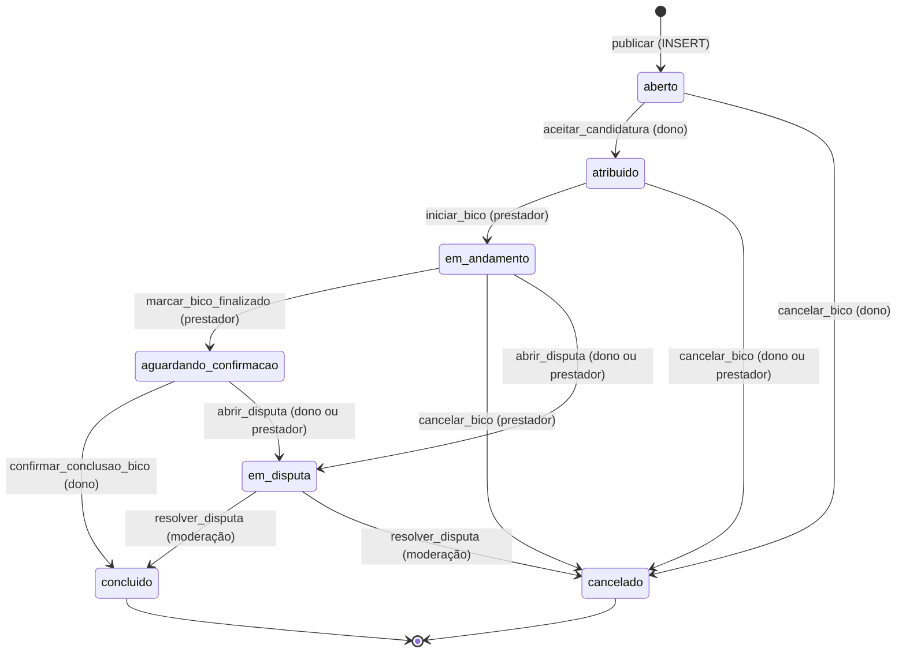

# Estou Dentro — Job lifecycle design (Phase 2)

| | |
| --- | --- |
| Baseline | `a22f32e` (Phase 1 merged: migrations `0001`–`0018`) |
| Branch | `feat/job-workflow` |
| Delivered by | migration `0019_ciclo_de_vida_transacional.sql` + app changes |
| Companion | [`ARCHITECTURE_SECURITY_AUDIT.md`](ARCHITECTURE_SECURITY_AUDIT.md) (Phase 1) |

This document has two halves: **what exists today** (Part A, written before any
Phase 2 change) and **what Phase 2 builds** (Part B). Database values stay in
Portuguese, following the existing convention (`aberto`, `em_andamento`, …).

---

## Part A — Current model (before Phase 2)

### A1. Job statuses (`bicos.status`)

Inline CHECK from [`0001_init.sql:85`](../supabase/migrations/0001_init.sql#L85):

| Value | Meaning today | How it is entered |
| --- | --- | --- |
| `aberto` | Published, accepting applications | Default on INSERT (forced by `validar_insercao_bico`, `0018`) |
| `em_andamento` | A worker was **chosen** (work may not have started) | `escolher_candidato()` RPC |
| `concluido` | Finished, reviews allowed | `fechar_bico_e_avaliar()` RPC, or **direct UPDATE by the owner** |
| `cancelado` | Cancelled | **Direct UPDATE by the owner** (`bico/[id].tsx:174`) |

Allowed transitions (trigger `validar_transicao_bico`, last version in `0018`):
`aberto → em_andamento | cancelado`, `em_andamento → concluido | cancelado`.

### A2. Application statuses (`candidaturas.status`)

`pendente` (default), `aceita`, `recusada`, `retirada` — CHECK in `0001_init.sql:128`;
`unique (bico_id, candidato_id)` at `0001_init.sql:130`.

### A3. Triggers

| Trigger | Table / timing | Function | Purpose |
| --- | --- | --- | --- |
| `on_auth_user_created` | `auth.users` AFTER INSERT | `handle_new_user` | Creates the profile |
| `bicos_set_atualizado_em` | `bicos` BEFORE UPDATE | `set_atualizado_em` | Touch timestamp |
| `bicos_validar_insercao` | `bicos` BEFORE INSERT | `validar_insercao_bico` (`0018`) | New job must be `aberto`, no worker, server dates |
| `bicos_validar_transicao` | `bicos` BEFORE UPDATE | `validar_transicao_bico` (`0018`) | Status graph, worker must be an active applicant ≠ owner, value/payment locked after `aberto` |
| `candidaturas_notificar` | `candidaturas` AFTER INSERT | `candidaturas_notificar` (`0017`) | Push to the job owner |
| `mensagens_notificar` | `mensagens` AFTER INSERT | `mensagens_notificar` (`0017`) | Push to the other participant |
| `avaliacoes_recalcular_reputacao` | `avaliacoes` AFTER INSERT OR DELETE | `avaliacoes_recalcular_reputacao` (`0014`) | Recompute `profiles` reputation |
| `chaves_pix_antes_inserir` / `chaves_pix_apos_excluir` | `chaves_pix` | — | Keep one primary Pix key |

### A4. RPC functions

| Function | Security | Used by | Notes |
| --- | --- | --- | --- |
| `escolher_candidato(p_bico_id, p_candidato_id)` | INVOKER | `bico/[id].tsx` | Accepts one application, rejects pending ones, job → `em_andamento`. No row lock. |
| `fechar_bico_e_avaliar(p_bico_id, p_nota, p_comentario)` | INVOKER | `chat/[id].tsx` | Owner alone: job → `concluido` + review + chat message. Worker never confirms anything. |
| `bicos_proximos(lat, lng, raio)` | DEFINER | — | Approximate proximity search (`0018`) |
| `conta_ativa()` | DEFINER | policies | `status_conta = 'ativo'` |
| `recalcular_reputacao(uuid)` | DEFINER | trigger only | Reputation from **all** reviews |
| `notificar_push(...)` | DEFINER | triggers only | Vault + `pg_net` (`0018`) |
| `contar_mensagens_nao_lidas`, `meu_telefone`, `meus_dados_pessoais`, `definir_chave_pix_principal` | — | various | Not lifecycle-related |

### A5. RLS / grants on lifecycle tables

| Table | SELECT | INSERT | UPDATE | DELETE |
| --- | --- | --- | --- | --- |
| `bicos` | every authenticated user, every row; all columns except `localizacao` | owner, `conta_ativa()` | owner (`criado_por = auth.uid()`), **every column** (no column grant) — only the trigger stands between the owner and the status column | none |
| `candidaturas` | candidate or job owner | candidate = `auth.uid()`, job `aberto`, `conta_ativa()` — **own job allowed, `status` chosen by the client** | column `status` only: owner may set `aceita`/`recusada` **at any time**; candidate `pendente → retirada` | none |
| `avaliacoes` | every authenticated user (public immediately) | `avaliador = auth.uid()`, job `concluido`, correct counterpart and role, `conta_ativa()` | none | none |
| `conversas` | participants | pair must be (owner, selected worker) | hide flags | none |

### A6. Screens that change job state

| Screen | Operation | How |
| --- | --- | --- |
| `criar-bico.tsx:141` | publish | `insert into bicos` |
| `bico/[id].tsx:191` | apply | `insert into candidaturas` (client sends `candidato_id`) |
| `bico/[id].tsx:127` | choose worker | `rpc('escolher_candidato')` |
| `bico/[id].tsx:174` | cancel (only while `aberto`) | **direct** `update bicos set status = 'cancelado'` |
| `chat/[id].tsx:232` | owner closes + reviews worker | `rpc('fechar_bico_e_avaliar')` |
| `chat/[id].tsx:243` | worker reviews owner | **direct** `insert into avaliacoes` (client sends reviewer, reviewee and role; RLS validates) |
| `utils/chat.ts:21` | open conversation | `insert into conversas` |

No hook or service updates lifecycle columns; the two direct writes above live in
screens. Read-only consumers of the statuses: `perfil.tsx`, `historico-bicos.tsx`,
`pagamentos.tsx`, `chat.tsx`, `chat/[id].tsx`, `use-estatisticas-perfil.ts`,
`use-bicos-abertos.ts`.

### A7. Problems with the current model

1. **The worker has no voice.** The owner marks the job `concluido` alone and reviews
   the worker in the same call — no signal that work happened (audit **M10**).
2. **`em_andamento` means "chosen", not "started"**, so the app cannot tell a job that
   is waiting for the worker from one being executed.
3. **Status is writable by direct UPDATE.** Cancellation is a raw
   `update … set status = 'cancelado'`; only the trigger validates it, with no record
   of who cancelled or why.
4. **Application integrity (audit M5):** own-job applications, client-chosen `status`
   on insert, owner flipping statuses at any time.
5. **No concurrency control:** `escolher_candidato` validates, then updates, without
   locking the job; two concurrent calls (or an application racing a selection) are
   not serialized.
6. **No disputes, no structured cancellation, no lifecycle timestamps**
   (`atualizado_em` is the only clock).
7. **Reviews are public the instant they are written**, so the second reviewer can
   retaliate; reputation counts reviews, and `total_bicos_como_*` is actually a review
   count, not completed jobs.
8. **Errors are free text** built into each function; the client can only show them
   verbatim.

---

## Part B — Phase 2 design

### B1. States

| Value (DB) | Concept | Meaning |
| --- | --- | --- |
| `aberto` | open | Published, accepting applications |
| `atribuido` | assigned | Owner accepted one application; waiting for the worker to start |
| `em_andamento` | in_progress | Worker started the service |
| `aguardando_confirmacao` | awaiting_confirmation | Worker says the service is done; owner must confirm |
| `concluido` | completed | Owner confirmed (or moderation decided); reviews open |
| `cancelado` | cancelled | Ended without completion |
| `em_disputa` | disputed | A participant opened a dispute; waits for moderation |



Every other transition is rejected by PostgreSQL (`INVALID_JOB_TRANSITION`),
whatever the role — including the dashboard.

### B2. Who may do what

| Action | RPC | Actor | From → to |
| --- | --- | --- | --- |
| Apply | `candidatar_se` (or direct INSERT) | any active user except the owner | job `aberto` |
| Withdraw application | `retirar_candidatura` | the applicant | application `pendente` |
| Accept application | `aceitar_candidatura` | owner | `aberto → atribuido` |
| Start | `iniciar_bico` | **selected worker** | `atribuido → em_andamento` |
| Mark finished | `marcar_bico_finalizado` | selected worker | `em_andamento → aguardando_confirmacao` |
| Confirm completion | `confirmar_conclusao_bico` | owner | `aguardando_confirmacao → concluido` |
| Cancel | `cancelar_bico` | see B5 | `→ cancelado` |
| Open dispute | `abrir_disputa` | owner or selected worker | `em_andamento`/`aguardando_confirmacao → em_disputa` |
| Resolve dispute | `resolver_disputa` | `service_role` only (future moderation) | `em_disputa → concluido | cancelado` |
| Review | `avaliar_bico` | owner or selected worker | job `concluido`, within 14 days |

Product decisions behind the table:

- **Only the worker starts.** Starting is the worker's check-in at the location. It
  keeps the owner's no-show path clean: while the job is `atribuido` the owner can
  cancel with reason `nao_compareceu`; once the worker has started, the owner's
  recourse is a dispute.
- **Completion needs both sides:** the worker declares the work done, the owner
  confirms. The worker can never complete a job; the owner can never complete a job
  the worker has not declared finished. A stuck confirmation goes to dispute.
- **Other applicants** get no lifecycle action at all.

### B3. How it is enforced

Three layers, each enough on its own for the rule it owns:

1. **Column privileges.** `authenticated` loses UPDATE on `bicos.status`,
   `candidato_selecionado_id` and the lifecycle timestamps, and all UPDATE on
   `candidaturas`. The owner keeps UPDATE on descriptive columns only while the job is
   `aberto`.
2. **SECURITY DEFINER RPCs** (`search_path = ''`, EXECUTE only for `authenticated`)
   check `auth.uid()`, the actor's role in the job, the current state and
   `conta_ativa()`. They lock the job row (`SELECT … FOR UPDATE`) before reading its
   state and do all side effects in one transaction.
3. **Triggers** keep the invariants for every writer: the transition graph, the
   worker can only change on `aberto → atribuido`, the worker must hold an active
   application and not be the owner, descriptive columns freeze after `aberto` (they
   are the record of what was agreed, which disputes rely on), and the lifecycle
   timestamps are stamped by the server (`atribuido_em`, `iniciado_em`,
   `finalizado_pelo_prestador_em`, `concluido_em`).

### B4. Application rules

| Rule | Where enforced |
| --- | --- |
| Not on own job | INSERT policy + BEFORE INSERT trigger |
| Not twice | existing `unique (bico_id, candidato_id)` (reused) → `APPLICATION_ALREADY_EXISTS` |
| Only while `aberto` | trigger re-reads the job under `FOR SHARE` (serializes with acceptance) |
| Status cannot be chosen | trigger forces `pendente` and server `criado_em` |
| Nobody edits applications directly | UPDATE revoked; only `aceitar_candidatura` / `retirar_candidatura` |
| At most one accepted per job | new partial unique index `where status = 'aceita'` |
| Suspended accounts cannot apply | existing `conta_ativa()` in the policy |
| Blocking between users | does not exist in the product yet (Phase 3) |

### B5. Cancellation

| Job status | Owner | Selected worker | Anyone else |
| --- | --- | --- | --- |
| `aberto` | yes | — | no |
| `atribuido` | yes | yes | no |
| `em_andamento` | **no** → open a dispute | yes (e.g. unsafe place, client absent) | no |
| `aguardando_confirmacao` | no → confirm or dispute | no → dispute | no |
| `em_disputa`, `concluido`, `cancelado` | no | no | no |

Reasons (`motivo`): `problema_de_agenda`, `desacordo_de_preco`,
`prestador_indisponivel`, `contratante_indisponivel`, `nao_compareceu`,
`ambiente_inseguro`, `outro` (`outro` requires details). Stored in the new table
`cancelamentos` (one row per job: who, reason, details, when), readable only by the
two participants — the job row stays public, so the free text does not go there.

### B6. Disputes

New table `disputas`: `bico_id`, `aberta_por`, `motivo`
(`servico_nao_realizado`, `problema_de_pagamento`, `comportamento_inseguro`,
`servico_diferente_do_combinado`, `nao_compareceu`, `outro`), `descricao`, `status`
(`aberta`, `em_analise`, `resolvida`), `resultado` (`concluido` / `cancelado`),
`resolucao`, `resolvida_por`, `resolvida_em`, timestamps. At most one unresolved
dispute per job (partial unique index). Readable by both participants; no direct
writes for anyone. `resolver_disputa` exists but is executable by `service_role` only,
ready for a future moderation tool.

### B7. Reviews and reputation

- `avaliar_bico(bico, nota, comentario)` derives reviewer, reviewee and role from
  `auth.uid()` — the client no longer sends identities. Direct INSERT/UPDATE/DELETE is
  revoked. Rules: job `concluido`, caller is a participant, one review per participant
  per job (existing unique), rating 1–5 (existing CHECK), within **14 days** of
  `concluido_em`.
- Table-level guarantees, independent of the RPC: `avaliacoes_sem_autoavaliacao`
  (CHECK reviewer ≠ reviewee) and the `avaliacoes_imutavel` trigger — once written, a
  review's job, author, reviewee, role, score and text never change, not even for
  `service_role` (`REVIEW_IMMUTABLE`); moderation removes a review with DELETE, which
  recalculates reputation.
- **Double-blind:** a review is visible to others only when the counterpart has also
  reviewed (`revelada_em` is stamped on both at that moment) or when the 14-day window
  closes. The author always sees their own review; the person reviewed does not see
  it early. After the window no new review is accepted, so nobody can review after
  reading the other side.
- **Reputation** (`profiles`, still not writable by users): averages and review counts
  come only from visible reviews (so a hidden score cannot be inferred from a changing
  average); `total_bicos_como_prestador/contratante` become **completed jobs** (they
  were review counts); new `total_avaliacoes_como_*`. Recalculated by triggers on
  reviews and on job status. A function `revelar_avaliacoes_vencidas()` refreshes
  reviews whose window expired; schedule it with `pg_cron` (manual step).

### B8. Notifications

Reuses the existing pipeline (trigger/RPC → `notificar_push` → `pg_net` → `enviar-push`).
New table `notificacoes` (recipient, type, job, **unique dedup key**, text): the RPC
inserts with `ON CONFLICT DO NOTHING` and only a new row triggers a push — a retried
action cannot notify twice. Everything runs inside an exception block, so a
notification problem can never undo the business action. Users can read their own
rows (foundation for an in-app inbox; no UI in this phase).

| Event | Recipient | Type |
| --- | --- | --- |
| application received | owner | `candidatura_recebida` |
| application accepted (= job assigned) | chosen worker | `candidatura_aceita` |
| application not chosen | other pending applicants | `candidatura_recusada` |
| job started | owner | `bico_iniciado` |
| job finished by worker | owner | `bico_finalizado` |
| job completed | worker | `bico_concluido` |
| job cancelled | counterpart / pending applicants | `bico_cancelado` |
| dispute opened | counterpart | `disputa_aberta` |
| dispute resolved | both | `disputa_resolvida` |
| review received (no score in the text) | reviewee | `avaliacao_recebida` |

`job_assigned` is deliberately the same notification as `application_accepted`: the
worker would otherwise get two pushes for one event.

### B9. Domain errors

RPCs and triggers raise `P0001` with a **user-facing Portuguese message** and a
**stable code in `HINT`** (PostgREST returns it as `error.hint`). Old app builds keep
showing the message; the new client maps the code in `utils/erros.ts` and never shows
raw database text.

| Code | Meaning |
| --- | --- |
| `NOT_AUTHENTICATED`, `ACCOUNT_SUSPENDED` | session / suspension |
| `JOB_NOT_FOUND`, `NOT_JOB_OWNER`, `NOT_SELECTED_WORKER`, `NOT_JOB_PARTICIPANT` | actor |
| `JOB_NOT_OPEN`, `JOB_ALREADY_ASSIGNED`, `JOB_NOT_ASSIGNED`, `JOB_NOT_IN_PROGRESS`, `JOB_NOT_AWAITING_CONFIRMATION`, `INVALID_JOB_TRANSITION`, `JOB_LOCKED`, `JOB_MUST_START_OPEN`, `JOB_FIELDS_IMMUTABLE` | state |
| `CANNOT_APPLY_OWN_JOB`, `APPLICATION_ALREADY_EXISTS`, `APPLICATION_NOT_FOUND`, `APPLICATION_NOT_PENDING`, `CANNOT_SELECT_OWNER`, `APPLICANT_UNAVAILABLE` | applications |
| `CANCELLATION_NOT_ALLOWED`, `INVALID_CANCELLATION_REASON`, `CANCELLATION_DETAILS_REQUIRED` | cancellation |
| `DISPUTE_NOT_ALLOWED`, `DISPUTE_ALREADY_OPEN`, `INVALID_DISPUTE_REASON`, `DISPUTE_DESCRIPTION_REQUIRED`, `DISPUTE_NOT_FOUND`, `DISPUTE_ALREADY_RESOLVED` | disputes |
| `REVIEW_NOT_ALLOWED`, `REVIEW_WINDOW_CLOSED`, `REVIEW_ALREADY_EXISTS`, `INVALID_RATING`, `REVIEW_IMMUTABLE` | reviews |

### B10. Concurrency

| Race | Protection |
| --- | --- |
| Owner accepts twice / two accepts arrive together | `aceitar_candidatura` locks the job row `FOR UPDATE` before reading its state; the second call waits, then sees `atribuido` and fails with `JOB_ALREADY_ASSIGNED` (or succeeds as a no-op if it is the same application). Backstops: partial unique index (one `aceita` per job) and the trigger (worker set only once). |
| Application arrives while the owner accepts | the insert trigger takes `FOR SHARE` on the job, waits for the acceptance and re-checks `aberto` |
| Withdraw vs. accept of the same application | both lock the job row first |
| Cancel / start / finish / confirm / dispute at the same time | all lock the job row `FOR UPDATE`; state re-checked after the lock |
| Both participants review at the same moment | `avaliar_bico` locks the job row, so the second review always sees the first and both get revealed |

Verified with a real two-connection test (see Tests), not only by the button being
disabled.

### B11. Migration plan and safety

- **One migration, `0019`**, executed as a single transaction by the SQL editor: the
  lifecycle is interdependent, so it applies completely or not at all.
- **No function changes its return type.** Every `CREATE OR REPLACE` targets a function
  whose current signature and return type are identical (checked against `0004`,
  `0011`, `0014`, `0015`, `0017`, `0018`): `escolher_candidato → void`,
  `fechar_bico_e_avaliar → void` (defaults kept), `recalcular_reputacao → void`,
  `validar_insercao_bico`, `validar_transicao_bico`, `candidaturas_notificar`,
  `avaliacoes_recalcular_reputacao → trigger`. All other functions are new.
  `bicos_proximos` is not touched. If a return type ever has to change, the rule is:
  `DROP FUNCTION` with the exact signature (never `CASCADE`), `CREATE`, then restore
  `REVOKE`/`GRANT`.
- **Legacy data mapping:** `em_andamento` rows (they meant "chosen") become
  `atribuido`; rows in impossible states (`em_andamento` without a worker, `aberto`
  with a worker) are normalized first; `concluido_em` is backfilled from
  `atualizado_em`; existing reviews stay public (`revelada_em = criado_em`);
  inconsistent `aceita` applications are normalized before the unique index.
  These updates run with the job triggers disabled inside the migration only.
- **Old app builds:** applying, choosing a worker (`escolher_candidato` becomes a
  wrapper over `aceitar_candidatura`) and chatting keep working. Cancelling and
  reviewing through old builds stop working, and they have no start/finish buttons,
  so the new build must be shipped with the migration.

### B12. Client changes

- New `utils/ciclo-bico.ts` (RPC wrappers, reason lists, cache invalidation) and
  `components/painel-ciclo-bico.tsx` (status banner, role-appropriate actions,
  cancel/dispute/review dialogs), used by `bico/[id].tsx` **and** `chat/[id].tsx` —
  one implementation of the lifecycle UI, adapted into the existing screens.
- `utils/bico.ts` gains the status labels; `perfil`, `historico-bicos`, `pagamentos`
  and `chat` learn the new statuses; push taps open the job for every lifecycle type.
- `utils/erros.ts` maps domain codes to Brazilian Portuguese messages.

### B13. Tests

| File (`supabase/tests/database/`) | Assertions | Covers |
| --- | ---: | --- |
| `ciclo_de_vida_bicos.test.sql` | 41 | forged INSERT, direct UPDATE denied, frozen agreement, full lifecycle through the RPCs, who may start/finish/confirm, idempotent repeats, transitions outside the graph (even for privileged roles) |
| `candidaturas.test.sql` | 26 | own job, duplicates, closed job, forced status, self-accept, non-owner accept, withdrawal, second worker, suspended accounts, legacy `escolher_candidato` |
| `cancelamento_disputas.test.sql` | 37 | cancellation matrix per stage and actor, reasons, who reads the record, disputes (who, when, one at a time), moderation-only resolution |
| `avaliacoes.test.sql` | 32 | review rules, double-blind visibility, 14-day window, immutability, reputation only from visible reviews, legacy `fechar_bico_e_avaliar` |
| `notificacoes.test.sql` | 24 | one notification per event and recipient, no score in the text, dedup on retries, per-user visibility, failure isolation, push queue |
| `concorrencia.test.sql` | 6 | **two real sessions via `dblink`**: a second acceptance waits for the job lock and is refused; an application arriving mid-acceptance waits and is refused |
| `privacidade.test.sql`, `push.test.sql` (Phase 1) | 26, 14 | still pass unchanged; privacy now also covers the new tables and RPCs |

The 16 scenarios required by the brief map to: own job, twice, closed job
(`candidaturas`); applicant accepting themselves, non-owner accepting, second worker
(`candidaturas`), concurrent acceptance (`concorrencia`); unrelated start / finish,
worker confirming, client confirming, invalid transitions (`ciclo_de_vida_bicos`);
unrelated cancel, unrelated dispute (`cancelamento_disputas`); review before
completion, unrelated reviewer, duplicate review (`avaliacoes`).

Unit tests (`npm test`): error mapping (`src/utils/erros.test.ts`) and the Edge
Function's accepted notification shapes (`validacao.test.ts`).

### B14. Verification results

| Check | Result |
| --- | --- |
| pgTAP, PostgreSQL 18.3 + PostGIS 3.6 (PGlite, Supabase platform emulated) | 7 suites, **200/200** (the concurrency file is skipped there: no `dblink`) |
| pgTAP, real PostgreSQL 18.4 server, multiple connections | 7 suites incl. concurrency, **180/180** (privacy suite not run here: no PostGIS) |
| Concurrency test with the `FOR UPDATE` removed on purpose | fails — the second request no longer gets `JOB_ALREADY_ASSIGNED`; the partial unique index still blocks a second worker (raw `23505`) |
| … with the lock **and** the unique index removed | fails the same way; the trigger still blocks a second worker ("O prestador escolhido não pode ser trocado") — three independent layers |
| `0019` on fabricated legacy data (old `em_andamento`, impossible states, double `aceita`) | 13/13, with and without `0018` applied |
| `npm test` | 24/24 |
| `npx tsc --noEmit`, `npx expo lint` | pass |
| `npx expo-doctor` | 20/21 — 7 patch-version mismatches, pre-existing (no dependency changed in Phase 2) |
| Android bundle (`npx expo export --platform android`) | builds |

Not verified here: `supabase test db` on the real Supabase stack (no Docker on this
machine), and the app on a device.

### B15. Manual steps

1. Run `0019_ciclo_de_vida_transacional.sql` in the SQL Editor (after `0018`). If `0018`
   ever failed with `42P13` and was rolled back, running `0019` still leaves the job
   rules correct (it re-defines everything it depends on); re-run `0018` separately
   for its push and proximity fixes, dropping `public.bicos_proximos(double precision,
   double precision, integer)` first if your deployed version has a different return
   type.
2. Redeploy the Edge Function (`supabase functions deploy enviar-push --no-verify-jwt`):
   it now accepts the new notification types.
3. Schedule the review-reveal refresh (optional but recommended; without it, a review
   that expires unanswered is visible on time but only counts in the averages at the
   reviewee's next review). Enable `pg_cron` in Dashboard → Database → Extensions,
   then in the SQL Editor:
   ```sql
   select cron.schedule('revelar-avaliacoes', '15 * * * *', 'select public.revelar_avaliacoes_vencidas()');
   ```
4. Ship the new app build together with the migration (old builds cannot start, finish
   or cancel jobs).

### B16. Known limitations and Phase 3

- **Moderation has a database entry point only** (`resolver_disputa`, `service_role`):
  until a moderation tool exists, disputes stay open and the job stays `em_disputa`.
- **No automatic confirmation:** if the owner never confirms, the worker's recourse is
  a dispute. A timed auto-confirm needs `pg_cron` and a product decision on the window.
- **Worker cancelling before start ends the job** instead of reopening it for the other
  applicants (who were already marked `recusada`).
- **Cancellation and dispute reasons are not yet shown on profiles**; no reputation
  weight for cancellations.
- No user-to-user blocking and no per-user rate limits (audit M7).
- `notificacoes` has no in-app inbox UI yet.
- Out of scope by request: payments, admin dashboard.
